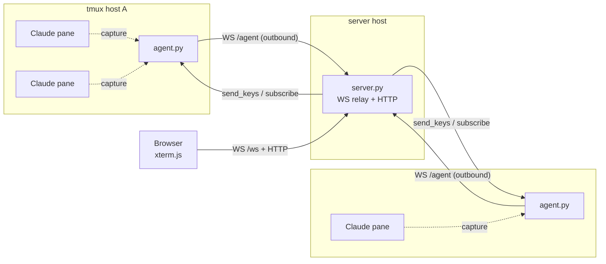

<p align="center">
  
</p>

<h1 align="center">Navi - Hey Listen</h1>

基于 [Claude Code](https://docs.anthropic.com/en/docs/claude-code) Skills 构建的个人助手。通过斜杠命令快速获取每日资讯、深度阅读论文、连接笔记系统，让 Claude 成为你的日常工作伙伴。

## 功能

| 命令 | 说明 |
|------|------|
| `/arxiv` | 筛选今日 arxiv 上 LLM 基模和训练系统相关论文 |
| `/paper <URL/标题>` | 深度阅读 arxiv 论文，输出逐段总结、Review、核心要素提取 |
| `/github [language]` | GitHub 每日热门仓库，支持按语言筛选 |
| `/zhihu` | 知乎当前热榜话题 |
| `/hfpapers` | Hugging Face Daily Papers 今日热门论文 |
| `/hackernews` | Hacker News 当前热门帖子 |
| `/producthunt` | Product Hunt 今日热门产品 |
| `/brief` | 每日简报，聚合以上所有信息源 |

## 快速开始

```bash
git clone https://github.com/yezhengmao1/navi.git
cd navi
claude
```

进入 Claude Code 后，它会自动引导你完成安装配置（MCP 依赖、config.toml、claude-hud 状态栏等）。

安装完成后直接使用：

```
> /arxiv              # 今日 LLM/训练系统论文
> /paper Scaling Law  # 按标题搜索并深度阅读
> /github             # 今日 GitHub 热榜
> /github rust        # Rust 语言热榜
> /zhihu              # 知乎热榜
> /hfpapers           # HF 今日热门论文
> /hackernews         # Hacker News 热帖
> /producthunt        # Product Hunt 热门产品
> /brief              # 每日简报（聚合全部）
```

## 配置

配置文件位于 `~/.navi/config.toml`：

```toml
[github]
token = "ghp_xxx"

[siyuan]
url = "http://127.0.0.1:6806"
token = "your-siyuan-api-token"
```

- `/github` 需要 GitHub token：[GitHub Settings > Personal access tokens](https://github.com/settings/tokens)，无需勾选任何 scope
- 思源笔记 MCP 需要配置 `siyuan.url` 和 `siyuan.token`

## 项目结构

```
.claude/
├── CLAUDE.md                    # 项目指令
├── settings.json                # MCP Server 配置
└── skills/
    ├── arxiv/SKILL.md           # arxiv 论文筛选
    ├── paper/SKILL.md           # 论文深度阅读
    ├── github/SKILL.md          # GitHub 热榜
    ├── zhihu/SKILL.md           # 知乎热榜
    ├── hfpapers/SKILL.md        # HF Daily Papers
    ├── hackernews/SKILL.md      # Hacker News
    ├── producthunt/SKILL.md     # Product Hunt
    └── brief/SKILL.md           # 每日简报
mcp/
└── siyuan/
    ├── index.js                 # 思源笔记 MCP Server
    └── package.json             # 依赖声明
scripts/
├── tmux-claude-status/
│   ├── install.sh               # 安装/卸载
│   ├── status-hook.sh           # hook 脚本
│   ├── claude-status.sh         # 弹窗显示脚本
│   └── statusline.sh            # 状态栏组件
└── tmux-web-bridge/
    ├── server.py                # Web UI + WS 中继
    ├── agent.py                 # tmux 主机端 agent
    ├── web/                     # 前端（xterm.js）
    ├── Dockerfile               # 服务端镜像
    └── docker-compose.yml       # 一键部署
```

## tmux-claude-status

tmux 插件，通过 Claude Code hooks 实时追踪所有 Claude 实例状态。

`prefix + a` 弹窗查看详情，按编号跳转到对应 pane。

```bash
# 安装（写入 hooks 到 ~/.claude/settings.json + tmux 快捷键）
bash scripts/tmux-claude-status/install.sh

# 卸载
bash scripts/tmux-claude-status/install.sh --uninstall
```

## tmux-web-bridge

Web UI，实时查看并接管任意主机上 tmux pane 里运行的 Claude Code 实例——包括远程机器。

- **server** 在一台机器上托管 Web UI
- **agent** 在每台跑着 tmux 的机器上运行，主动把 Claude pane 推到 server
- 浏览器按 host 分组查看所有 agent 的 pane，可直接输入、滚动、查看 scrollback



- agent 只发起出站连接，tmux 所在主机无需开放任何入站端口
- snapshot 服务端去重，空闲 pane 不产生流量
- 同一 `--token` 同时守护 agent↔server 握手 和 浏览器访问

```bash
cd scripts/tmux-web-bridge
pip install -r requirements.txt

# server
export BRIDGE_TOKEN=$(openssl rand -hex 16)
python server.py --token "$BRIDGE_TOKEN"

# agent（每台 tmux 机器）
python agent.py --server ws://<server-host>:8787/agent --token "$BRIDGE_TOKEN"
```

也可通过 `docker compose up -d` 部署 server。详见 [scripts/tmux-web-bridge/README.md](scripts/tmux-web-bridge/README.md)。

> 安全提示：连到 server 的浏览器等同于对每个 Claude pane 拥有远程 shell 权限，请通过 VPN / 反向代理 / SSH 隧道保护端口，并始终配置 `--token`。

## License

[Hey-Listen License (HLL)](LICENSE)
